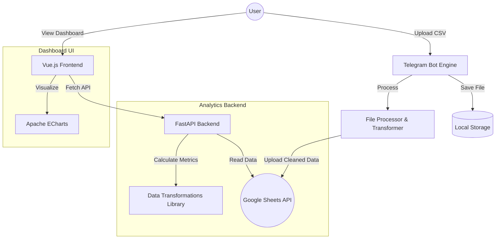

# Repo scan
- **Files read:** `app.py`, `backend/main.py`, `handlers/telegram_handler.py`, `handlers/file_handler.py`, `processors/file_processor.py`, `services/google_sheet_services.py`, `services/dashboard_service.py`, `transformations/data_transformations.py`, `docker-compose.yml`, `requirements.txt`, `backend/requirements.txt`, `frontend/package.json`, `frontend/src/api.js`, `frontend/src/App.vue`.
- **Data flow:** The pipeline begins with a user uploading a `.csv` expense export to a Telegram Bot. The `telegram_handler` saves the file and triggers the `file_handler` orchestrator, which uses `file_processor` and `data_transformations` to clean and normalize the data before uploading it to a Google Sheet via `google_sheet_services`. Once in Google Sheets, the data is fetched by a FastAPI backend (`backend/main.py`) using `dashboard_service`, which serves calculated analytics and transaction history to a Vue.js frontend.
- **Ambiguities:** `service_account.json` is required for Google Sheets API access but is not present in the repo (expected). `TOTAL_BUDGET` is independently hardcoded in both `backend/main.py` and `services/dashboard_service.py`.

---

# Expense Reporting Pipeline

This project is an automated, end-to-end expense ingestion and visualization pipeline designed for travelers and small business owners who need to transform raw CSV exports into actionable financial dashboards. It demonstrates a robust handling of unstructured data, cloud integration with Google Sheets, and a modern microservices architecture, solving the problem of manual data entry and fragmented financial tracking.

## Architecture



## Tech Stack

| Component | Technology | Purpose |
|-----------|------------|---------|
| Bot Engine | `python-telegram-bot` | Handles asynchronous file ingestion and user interaction. |
| Data Processing | `pandas`, `numpy` | Cleans, filters, and transforms raw CSV exports into normalized datasets. |
| Cloud Storage | Google Sheets API (`gspread`) | Acts as a persistent, accessible-anywhere data warehouse. |
| Backend API | FastAPI | Serves aggregated metrics and transaction data via REST endpoints. |
| Frontend | Vue.js 3, Vite | Modern reactive UI for displaying financial analytics. |
| Visualization | Apache ECharts | Renders interactive breakdown and trend charts. |
| Containerization | Docker & Docker Compose | Orchestrates the multi-container environment. |

## Project Structure

```text
.
├── app.py                      # Telegram Bot entry point
├── backend/
│   ├── main.py                 # FastAPI server and analytics routes
│   └── requirements.txt        # Backend-specific dependencies
├── docker-compose.yml          # Container orchestration config
├── Dockerfile                  # Bot service container definition
├── frontend/
│   ├── src/
│   │   ├── api.js              # Axios configuration for API calls
│   │   ├── App.vue             # Main Vue application entry
│   │   └── components/         # Modular dashboard components (Charts, Tables)
│   └── Dockerfile              # Frontend container definition
├── handlers/
│   ├── telegram_handler.py     # Message and document event logic
│   └── file_handler.py         # Orchestration between processor and Google Sheets
├── processors/
│   └── file_processor.py       # High-level file loading and packaging logic
├── requirements.txt            # Bot and data processing dependencies
├── services/
│   ├── google_sheet_services.py# GSpread wrapper for Sheet I/O
│   └── dashboard_service.py    # Service for reading data into the API
└── transformations/
    └── data_transformations.py # Core business logic and statistical calculations
```

## Quick Start

1. **Clone and Configure:**
   ```bash
   git clone <repo-url>
   cd expense-reporting-pipeline
   ```
2. **Environment Setup:**
   Create a `.env` file with your credentials:
   ```text
   TELEGRAM_TOKEN=your_bot_token
   GOOGLE_SHEET_ID=your_spreadsheet_id
   VITE_API_BASE_URL=http://localhost:8000
   ```
   *Note: Place your `service_account.json` in the root directory.*
3. **Launch Pipeline:**
   ```bash
   docker-compose up --build
   ```
4. **Usage:**
   - Send a CSV to your bot.
   - Access the dashboard at `http://localhost:3000`.

## How it Works

1. **Ingestion:** `handlers/telegram_handler.py` listens for `filters.Document.ALL`. When a `.csv` is received, it downloads the file to the `downloads/` directory.
2. **Orchestration:** The handler calls `orchestrate_file_process` in `handlers/file_handler.py`, which coordinates the transformation and upload steps.
3. **Transformation:** `processors/file_processor.py` invokes `process_main_data` from `transformations/data_transformations.py`. This function:
    - Normalizes columns (e.g., `datePaid` to `Date`).
    - Cleans currency strings using regex: `df['Amount'].str.replace(r'[^\d\.]', '', regex=True)`.
    - Filters out specific categories like "Flights".
4. **Synchronization:** The `GoogleSheetsService` in `services/google_sheet_services.py` uses `worksheet.update('A1', data)` to overwrite the "Cleaned_Data" tab with the new dataset.
5. **Consumption:** The FastAPI backend calls `get_data()` in `services/dashboard_service.py`, which fetches the spreadsheet via `read_sheet_to_dataframe`.
6. **Visualization:** The frontend components (e.g., `BurnTrendCharts.vue`) use `axios` to fetch these calculated metrics and render them using `vue-echarts`.

## Design Decisions

- **Google Sheets as a Database:** Instead of a traditional SQL DB, Google Sheets was used (`services/google_sheet_services.py`) to allow users to manually audit or edit their data without needing a separate admin UI.
- **Stateless Transformation Library:** All calculation logic is centralized in `transformations/data_transformations.py`, ensuring that both the ingestion pipeline and the dashboard API use identical logic for metrics like `calculate_daily_average_per_category`.
- **CORS Middleware Configuration:** The FastAPI app explicitly allows all origins in `backend/main.py` using `CORSMiddleware` to simplify development across Docker containers without complex proxying.
- **Multi-stage Docker Builds:** The `frontend/Dockerfile` uses Vite to build static assets which are then served via Nginx, reducing the production container footprint and improving load times.

## What this Demonstrates

- **ETL Pipeline Design:** Proves the ability to build a full Extract-Transform-Load cycle, evidenced by `handlers/file_handler.py`.
- **Data Engineering:** Demonstrates complex data manipulation and normalization using Pandas, specifically in `transformations/data_transformations.py`.
- **Microservices Orchestration:** Shows proficiency in connecting disparate services (Bot, API, Frontend) via `docker-compose.yml`.
- **Cloud API Integration:** Proof of secure and efficient interaction with third-party APIs (Google, Telegram) in `services/google_sheet_services.py`.

## Limitations / Out of Scope

- **User Authentication:** The dashboard is currently public. In a production environment, an OAuth2 layer would be required for the API.
- **Concurrent File Processing:** The bot processes files sequentially. If multiple users upload simultaneously, files are handled in the order received due to the `run_polling()` nature of the bot in `app.py`.
- **Incremental Data Updates:** Currently, every CSV upload overwrites the entire Google Sheet. This avoids duplicates but is inefficient for extremely large historical datasets.
