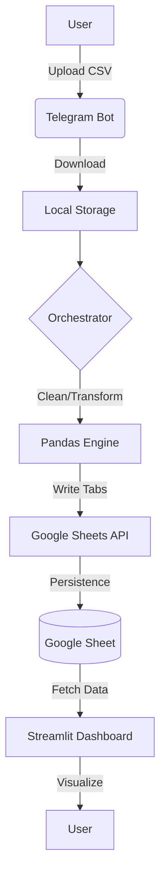

# Expense Reporting Pipeline

This project is an automated ETL (Extract, Transform, Load) pipeline designed to convert raw travel expense exports into a live analytics dashboard. It solves the problem of manual expense tracking by allowing users to upload a CSV file via a Telegram bot, which automatically triggers data cleaning and updates a Google Sheets backend for a Streamlit dashboard. It demonstrates the integration of messaging APIs, cloud spreadsheets, and data visualization tools into a cohesive personal finance tool for technical portfolio demonstration.

## Architecture



## Tech Stack

| Component | Technology | Purpose |
| :--- | :--- | :--- |
| **Ingestion** | Telegram Bot API | User interface for file uploads and status updates. |
| **Processing** | Pandas | Data cleaning, filtering, and metric calculation. |
| **Storage** | Google Sheets API | Intermediate data warehouse and persistence layer. |
| **Visualization** | Streamlit | Interactive web dashboard for data exploration. |
| **Charts** | Plotly | Dynamic, mobile-responsive data visualizations. |
| **Deployment** | Docker | Containerization of the bot and dashboard services. |

## Project Structure

```text
.
├── app.py                     # Entry point for the Telegram bot service
├── dashboard.py               # Main Streamlit application file
├── docker-compose.yml         # Orchestration for multi-container deployment
├── Dockerfile                 # Container definition for the unified service
├── handlers/
│   ├── file_handler.py        # Coordinates processing and cloud upload logic
│   └── telegram_handler.py    # Manages bot commands and file downloads
├── processors/
│   └── file_processor.py      # Entry point for the data transformation layer
├── services/
│   ├── dashboard_service.py   # Business logic for dashboard metrics and charts
│   └── google_sheet_services.py # Wrapper for Google Sheets API operations
├── transformations/
│   └── data_transformations.py # Core logic for cleaning and calculating metrics
├── requirements.txt           # Python project dependencies
└── run.sh                     # Startup script to launch bot and dashboard concurrently
```

## Quick Start

1. **Clone the repository:**
   ```bash
   git clone <repository-url>
   cd expense-reporting-pipeline
   ```

2. **Configure environment:**
   Create a `.env` file in the root directory with the following variables:
   ```text
   TELEGRAM_TOKEN=your_bot_token
   GOOGLE_SHEET_ID=your_spreadsheet_id
   ```
   Place your `service_account.json` (Google Cloud credentials) in the root directory.

3. **Launch the pipeline:**
   ```bash
   docker-compose up --build
   ```

## How it Works

1. **Ingestion**: The Telegram bot (`app.py`) listens for documents via `handle_document` in `handlers/telegram_handler.py`. It validates the file extension and saves the raw CSV to a local directory.
2. **Orchestration**: Once saved, `orchestrate_file_process` in `handlers/file_handler.py` is triggered. It calls the processor to transform the file and then uses the `GoogleSheetsService` to upload the result.
3. **Transformation**: The `load_and_process_data` function in `processors/file_processor.py` reads the CSV and applies `process_main_data` from `transformations/data_transformations.py`. This step cleans dates, normalizes currency, and filters out excluded categories like "Flights".
4. **Cloud Load**: Data is written to Google Sheets using `write_dataframe_to_sheet` in `services/google_sheet_services.py`, which clears existing tabs and updates them with the new cleaned data.
5. **Visualization**: The Streamlit dashboard (`dashboard.py`) calls `get_data` from `services/dashboard_service.py`, which pulls the latest cleaned records from Google Sheets for rendering in Plotly charts.

## Design Decisions

- **Google Sheets as a Data Warehouse**: Instead of a traditional SQL database, Google Sheets was chosen to allow manual auditing of cleaned data. This is implemented in `services/google_sheet_services.py` through the `GoogleSheetsService` class.
- **Unified Process Execution**: Both the bot and the dashboard are packaged in a single Docker image and executed via `run.sh`. This simplifies deployment by avoiding the overhead of managing two separate services for a low-traffic personal tool.
- **Calculated View Decoupling**: Metrics like "Daily Average per Country" are calculated on-the-fly in `transformations/data_transformations.py` (e.g., `calculate_average_daily_budget_per_country`) rather than stored. This ensures the dashboard reflects the most recent transformation logic without full data re-import.
- **Mobile-Responsive UI**: The dashboard is explicitly configured with `layout="centered"` and `initial_sidebar_state="collapsed"` in `dashboard.py` to optimize the viewing experience on smartphones.

## What this Demonstrates

- **ETL Pipeline Design**: Orchestration of data flows from ingestion to visualization. Evidence: `handlers/file_handler.py`.
- **API Integration**: Production-ready implementation of third-party APIs (Telegram, Google) with proper authentication. Evidence: `services/google_sheet_services.py`.
- **Data Engineering Fundamentals**: Implementation of data cleaning, type conversion, and outlier filtering using Pandas. Evidence: `transformations/data_transformations.py`, specifically `process_main_data`.
- **Cloud-Native Deployment**: Use of Docker and environment-based configuration for portable service execution. Evidence: `Dockerfile` and `docker-compose.yml`.

## Limitations / Out of scope

- **Single User Constraint**: The architecture uses a global `GOOGLE_SHEET_ID` defined in `.env`, meaning it supports one active spreadsheet per deployment.
- **Stateless Ingestion**: The pipeline overwrites the Google Sheet tabs on every upload via `worksheet.clear()` in `services/google_sheet_services.py`. It does not support incremental updates.
- **Memory Management**: `file_processor.py` loads entire CSVs into memory; while sufficient for personal expense tracking, enterprise-scale datasets would require a chunking strategy.
