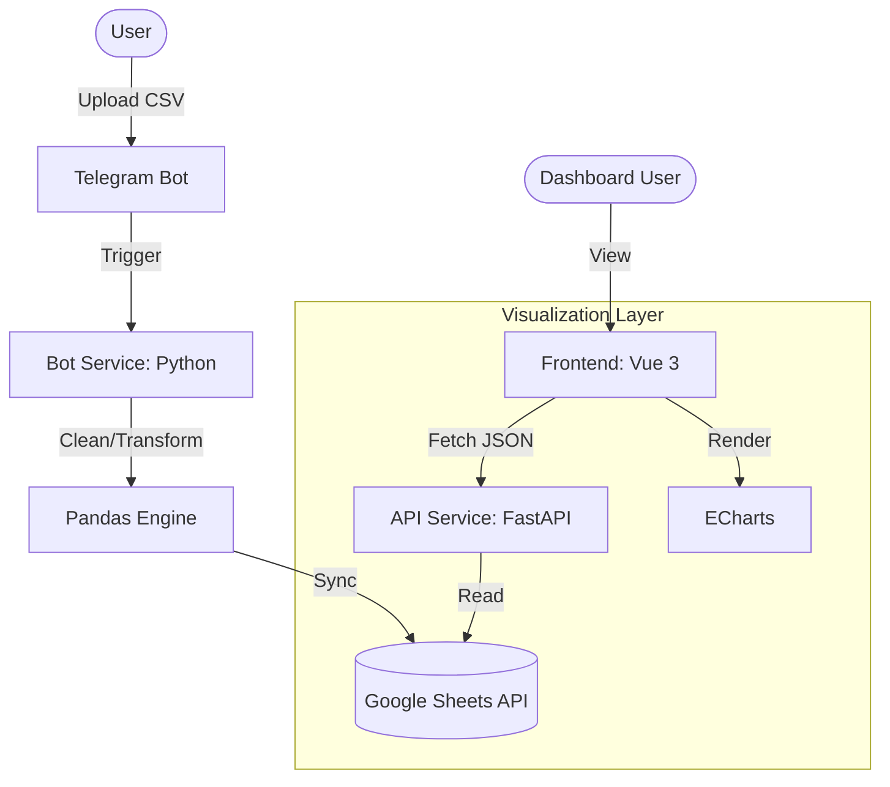

# Expense Reporting Pipeline & Dashboard

## 1. What this project is
This project is an automated ETL (Extract, Transform, Load) pipeline that converts raw CSV expense exports into a structured, interactive financial dashboard. It solves the friction of manual expense tracking by using a Telegram bot as the ingestion interface and Google Sheets as a low-cost, human-readable data store. The system demonstrates a decoupled architecture suitable for personal or small-team financial monitoring, providing real-time budget burn rates and categorical spending analysis.

## 2. Architecture


## 3. Tech stack

| Component | Technology | Purpose |
| :--- | :--- | :--- |
| **Ingestion** | Python-Telegram-Bot | Interface for mobile data entry and file uploads. |
| **ETL Engine** | Pandas | Data cleaning, type conversion, and categorical aggregation. |
| **Primary Storage** | Google Sheets | Acts as both a database and a manual data entry fallback. |
| **Backend API** | FastAPI | High-performance asynchronous API for data retrieval. |
| **Frontend** | Vue 3 + Vite | Reactive single-page application for the dashboard. |
| **Visualizations** | Apache ECharts | Interactive rendering of complex financial charts. |
| **Orchestration** | Docker Compose | Management of the bot, API, and frontend services. |

## 4. Project structure
```text
.
├── app.py                      # Telegram bot entry point and polling loop.
├── backend/
│   ├── main.py                 # FastAPI application and REST endpoints.
│   ├── requirements.txt        # Python dependencies for the API service.
│   └── Dockerfile              # Container definition for the FastAPI service.
├── frontend/
│   ├── src/
│   │   ├── components/         # Vue components (Summary, Charts, Table).
│   │   ├── api.js              # Axios configuration for backend communication.
│   │   └── App.vue             # Main frontend entry point and layout.
│   └── Dockerfile              # Multi-stage build for Vue/Nginx.
├── handlers/
│   ├── file_handler.py         # Orchestrates ETL pipeline from bot triggers.
│   └── telegram_handler.py     # Logic for handling Telegram messages and files.
├── processors/
│   └── file_processor.py       # Manages CSV loading and transformation sequence.
├── services/
│   ├── google_sheet_services.py # Wrapper for gspread and Google Auth.
│   └── dashboard_service.py    # Business logic for fetching data from Sheets.
├── transformations/
│   └── data_transformations.py # Core Pandas logic for financial metrics.
├── docker-compose.yml          # Service definitions for bot, api, and frontend.
└── requirements.txt            # Python dependencies for the bot service.
```

## 5. Quick start
1. **Prepare Credentials**: Place your Google Cloud `service_account.json` in the root directory.
2. **Configure Environment**: Create a `.env` file in the root:
   ```env
   TELEGRAM_TOKEN=your_bot_token
   GOOGLE_SHEET_ID=your_spreadsheet_id
   ```
3. **Launch Stack**:
   ```bash
   docker-compose up --build
   ```
4. **Access**:
   - Dashboard: `http://localhost:3000`
   - API Docs: `http://localhost:8000/docs`

## 6. How it works
1. **Ingestion**: The user sends a CSV to the Telegram bot (`app.py`). The `handle_document` function in `handlers/telegram_handler.py` downloads the file and passes the path to the orchestrator.
2. **Transformation**: `orchestrate_file_process` in `handlers/file_handler.py` calls `load_and_process_data` (`processors/file_processor.py`). This invokes `process_main_data` in `transformations/data_transformations.py`, which cleans date formats, handles currency symbols, and filters excluded categories like "Flights" (see `EXCLUDE_CATEGORY` in `data_transformations.py`).
3. **Persistence**: The processed DataFrame is uploaded to the "Cleaned_Data" tab via `write_dataframe_to_sheet` in `services/google_sheet_services.py`.
4. **Data Serving**: The FastAPI app (`backend/main.py`) calls `get_data()` in `services/dashboard_service.py` to fetch the sheet contents. It then applies domain-specific transformations (e.g., `calculate_summary` logic) to return structured JSON.
5. **Visualization**: The Vue frontend fetches this JSON via `api.js` and updates the reactive state in `DashboardShell.vue`, which propagates data to specialized ECharts components like `BurnTrendCharts.vue`.

## 7. Design decisions
- **Google Sheets as a Persistence Layer**: Instead of a relational database, Google Sheets was chosen to allow the user to manually correct or audit data without a custom admin UI. Evidence: `services/google_sheet_services.py` and `services/dashboard_service.py` fetching from specific tab names.
- **Decoupled Transformation Logic**: All Pandas logic is isolated from the IO handlers. This allows the same transformation functions to be used by both the bot's upload process and the API's read process. Evidence: `transformations/data_transformations.py` is imported by both `processors/file_processor.py` and `backend/main.py`.
- **Logarithmic Scaling for Multi-Country Spending**: In the country comparison charts, spending often varies by orders of magnitude. The system implements logarithmic axes to maintain visibility for smaller-scale country stays. Evidence: `dashboard_service.py` (legacy) and the implementation of `totalOption` in `CountryBarCharts.vue`.
- **Multi-Stage Docker Builds**: To minimize production image size and security surface area, the frontend uses a multi-stage build to compile Vue source into static assets served by Nginx. Evidence: `frontend/Dockerfile`.

## 8. What this demonstrates
- **Asynchronous Python Development**: Implementation of a non-blocking API layer using FastAPI in `backend/main.py`.
- **Complex Data Transformations**: Handling of dirty financial data, currency cleaning, and multi-dimensional aggregations in `transformations/data_transformations.py`.
- **Container Orchestration**: Managing a heterogeneous stack (Python, Node/Nginx, Google APIs) via `docker-compose.yml`.
- **Modern Frontend Architecture**: Building a reactive, component-based dashboard with Vue 3 Composition API and optimized chart rendering in `frontend/src/components/`.

## 9. Limitations / Out of scope
- **Authentication**: The dashboard (`http://localhost:3000`) does not have an authentication layer. It is intended for deployment within a private network or behind a VPN.
- **Google Sheets API Quotas**: Since every dashboard refresh triggers a read from Google Sheets, the project is subject to API rate limits. It is not suitable for high-traffic public use without an intermediate caching layer (e.g., Redis).
- **Single-User CSV Processing**: The pipeline assumes a consistent CSV schema (defined in `data_transformations.py`). It does not currently support multiple differing bank export formats simultaneously.
