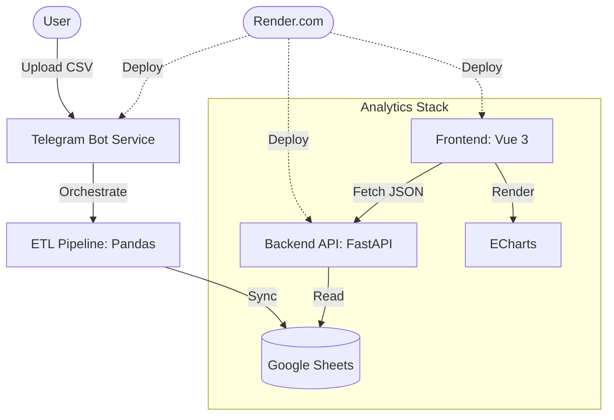

# Expense Reporting Pipeline & Dashboard

## 1. What this project is
This project is an automated ETL pipeline that converts raw CSV financial exports into an interactive, cloud-deployed dashboard. It solves the problem of fragmented personal expense tracking by providing a frictionless mobile ingestion interface (Telegram) and a centralized visualization layer. The system demonstrates a modern, decoupled architecture designed for high availability on Render, utilizing Google Sheets as a flexible and transparent data store for budget monitoring and burn-rate analysis.

## 2. Architecture


## 3. Tech stack

| Component | Technology | Purpose |
| :--- | :--- | :--- |
| **Ingestion** | Python-Telegram-Bot | Mobile-first CSV file receiver. |
| **ETL Engine** | Pandas | Data cleaning and multi-dimensional aggregations. |
| **Persistence** | Google Sheets API | Low-latency, human-auditable data storage. |
| **Backend API** | FastAPI | Asynchronous REST layer for dashboard data. |
| **Frontend** | Vue 3 + Vite | Reactive SPA for financial visualization. |
| **Charts** | Apache ECharts | High-performance interactive rendering. |
| **Deployment** | Docker & Render | Infrastructure-as-Code (IaC) for 3-service topology. |

## 4. Project structure
```text
.
├── app.py                      # Telegram bot entry point and polling loop.
├── Dockerfile                  # Background worker definition for the bot.
├── docker-compose.yml          # Local orchestration for all 3 services.
├── render.yaml                 # Infrastructure-as-Code for Render deployment.
├── backend/
│   ├── main.py                 # FastAPI application and CORS configuration.
│   └── Dockerfile              # Web service definition for the API.
├── frontend/
│   ├── src/                    # Vue source code and component tree.
│   ├── nginx.conf              # Dynamic port-binding template for Nginx.
│   └── Dockerfile              # Multi-stage build for the frontend SPA.
├── handlers/
│   ├── file_handler.py         # Pipeline orchestration logic.
│   └── telegram_handler.py     # Telegram event and file handlers.
├── processors/
│   └── file_processor.py       # CSV loading and packaging sequence.
├── services/
│   ├── google_sheet_services.py # Google Auth and gspread wrapper.
│   └── dashboard_service.py    # Data retrieval and business logic.
└── transformations/
    └── data_transformations.py # Core Pandas cleaning and metrics functions.
```

## 5. Quick start
1. **Prepare Credentials**: Place your `service_account.json` in the root directory.
2. **Configure Environment**: Create a `.env` file in the root:
   ```env
   TELEGRAM_TOKEN=your_token
   GOOGLE_SHEET_ID=your_sheet_id
   ```
3. **Launch Local Stack**:
   ```bash
   docker-compose up --build
   ```
4. **Access**:
   - Dashboard: `http://localhost:3000`
   - API Docs: `http://localhost:8000/docs`

## 6. How it works
1. **Ingested Document Validation**: The bot (`app.py`) listens for documents. `handle_document` in `handlers/telegram_handler.py` validates the `.csv` extension before downloading.
2. **Orchestrated Transformation**: `orchestrate_file_process` (`handlers/file_handler.py`) initializes the pipeline. `process_main_data` in `transformations/data_transformations.py` standardizes column names, converts currencies via regex, and filters out non-expense categories like "Flights".
3. **Synchronized Persistence**: The `GoogleSheetsService` (`services/google_sheet_services.py`) clears and overwrites the "Cleaned_Data" tab with the new DataFrame.
4. **Asynchronous Data Serving**: The FastAPI backend (`backend/main.py`) exposes endpoints like `/api/summary`. It utilizes `get_data` from `services/dashboard_service.py` to retrieve the latest state from Google Sheets.
5. **Reactive Visualization**: The Vue 3 frontend fetches data via Axios (`frontend/src/api.js`). Components like `BurnTrendCharts.vue` receive this data and update interactive ECharts instances.

## 7. Design decisions
- **Decoupled 3-Service Topology**: The separation into `bot`, `api`, and `frontend` allows for independent scaling and prevents bot polling from blocking dashboard requests. (Evidence: `render.yaml` service list).
- **Environment-Based Credentials**: The system supports both local file-based and environment-injected JSON credentials to accommodate cloud environments without persistent storage. (Evidence: `services/google_sheet_services.py` L17-23).
- **SPA Fallback with Dynamic Port Binding**: The Nginx configuration uses `envsubst` to bind to the Render-injected `$PORT` while ensuring all routes redirect to `index.html` for Vue Router compatibility. (Evidence: `frontend/Dockerfile` L24 and `frontend/nginx.conf`).
- **Google Sheets as Audit Log**: By using Sheets instead of a traditional DB, users can manually correct categorization errors without a custom administrative interface. (Evidence: `services/google_sheet_services.py` L43).

## 8. What this demonstrates
- **ETL Pipeline Design**: Orchestrating complex data flows from ingestion to persistence. (Evidence: `handlers/file_handler.py`).
- **Cloud-Native Infrastructure**: Implementing IaC and containerization for distributed environments. (Evidence: `render.yaml`, `docker-compose.yml`).
- **Advanced Data Engineering**: Utilizing Pandas for non-trivial data cleaning and aggregation. (Evidence: `transformations/data_transformations.py`).
- **Full-Stack Performance**: Implementing asynchronous backend services and reactive frontend visualizations. (Evidence: `backend/main.py`, `frontend/src/components/DashboardShell.vue`).

## 9. Limitations / Out of scope
- **Multi-Tenant Support**: The system is designed for a single Google Sheet ID. It does not support multiple users with different spreadsheets.
- **Real-Time WebSockets**: Data is fetched via standard HTTP polling/refresh. Real-time WebSocket updates were omitted to reduce complexity and stay within Google API rate limits.
- **Authentication**: No authentication layer is included on the dashboard. It is designed to be deployed with private environment variables on a platform like Render.
